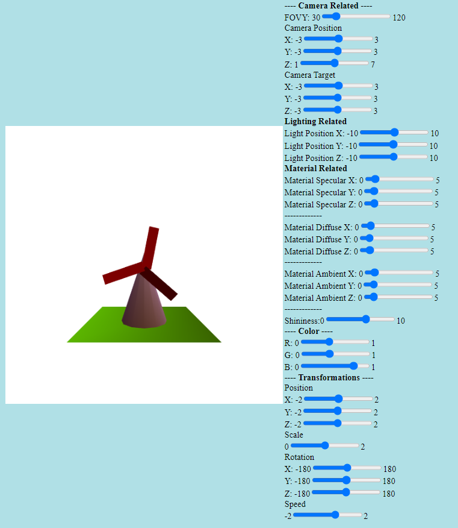

# CG-WebGL
WebGL assigments that I made during the Computer Graphics course. 

<h3>Assigment-2</h3>

![assigment-2]SecondHomework.png

<h3>Assigment-3</h3>

![assigment-3]ThirdHomework.png 

<h3>Assigment-4</h3>

